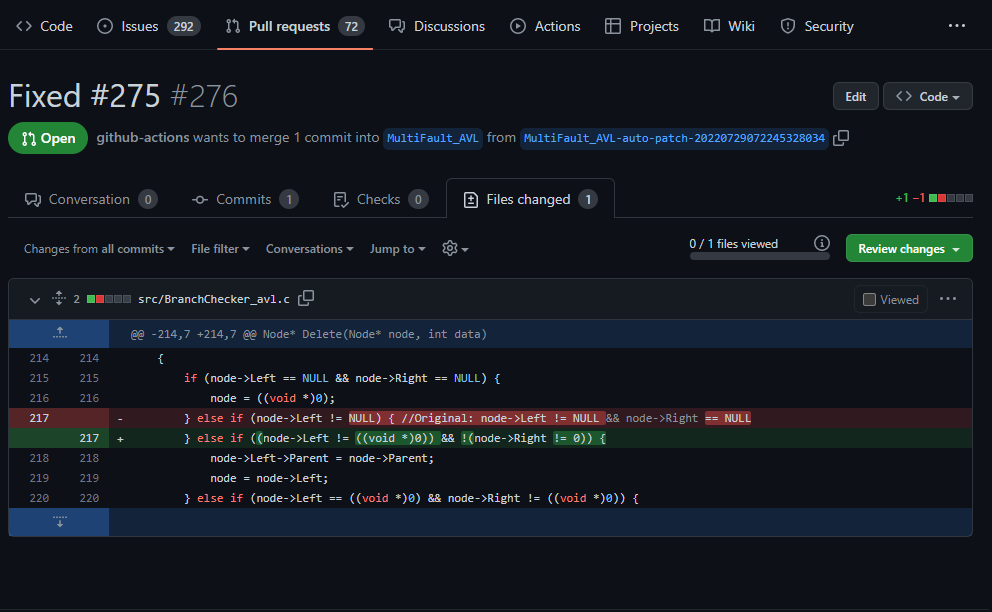

# Suresofttech Vulcan for GitHub Actions

Vulcan is a handy and claver supporter for trivial fault in your C/C++ code. It can find it, and even can fix it!

Vulcan action can be triggered by a regression tests, or you can run it seperately. After all the processes, it generate issue and pull request itself.

* Issue - Show which test failed and suspicious location ranking from SBFL(Spectrum Based Fault Localization). If there are some suggestions for the fault, the issue also show the generated patch to fix it.
* Pull requests - If the patch was generated well, Vulcan sends pull request about it.

If there are multiple faults and they were figured out from different testsets, those two output will be generated for each fault.

To add Vulcan to your test workflow orjust run it, follow the steps under the *Set Runner* and *Set vulcan.yml* section.

## Requirements
* The fault must be single line fault
* The project have to use 'make' command to build

## Set Runner

You can run Vulcan in two different ways. It can be run on your self-hosted-runner, or GitHub runner. For each case, you have to set up your .yml file.


**Case 1: Use GitHub runner**

* Add checkout to your workflow:

  For Vulcan to run, check out your repository using [actions/checkout@v2](https://github.com/actions/checkout). For example:

```
- name: Checkout vulcan target
  uses: actions/checkout@v2
```


**Case 2: Use your self hosted runner**

* Add checkout to your workflow:

   Likewise, you have to checkout your repository as case 1.


* Set docker container in your workspace

Additionaly, you have to set the runner with provided docker image.

1. Pull image

```
   docker pull 0cherry/vulcan:demo
```

2. Run container from above image and run self-hosted-runner in the container
   (In your repository, you can find an manual to run the self hosted runner in 'Action' tab.)

We recommend following the instructions and using [aws-actions/configure-aws-credentials](https://github.com/aws-actions/configure-aws-credentials) to configure your credentials for a job. The IAM user or IAM role requires [AmazonCodeGuruReviewerFullAccess](https://docs.aws.amazon.com/codeguru/latest/reviewer-ug/auth-and-access-control-iam-identity-based-access-control.html#managed-full-access) policy and S3 permissions (s3:PutObject, s3:ListBucket, s3:GetObject) for the "codeguru-reviewer-*" S3 bucket.  The CodeGuru Reviewer action supports credentials from GitHub hosted runners and self-hosted runners.

## Set vulcan.yml

In your repository, there should be vulcan.yml file. A simple example of vulcan.yml file is here.

```
--- # Start
name: example

# 유저의 github 저장소 정보
url:
docker-image: 

# predefined docker-image를 사용하되, 추가적인 설정이 필요한 경우 이렇게 정의
extra-build-env-setting-commands: 

test-candidates: |
  example.c
time-out: 10
max-patch-number : 500

test-build-command: | # 테스트 빌드 커맨드 / defect4cpp 기준 meta.json의 내용이 필요
  make clean
  make
coverage-build-command: | # 커버리지 빌드 커맨드 / defect4cpp 기준 meta.json의 내용이 필요(SBFL: gcov)
  make clean
  make CFLAGS="--coverage -g -O0" LDFLAGS="-lgcov"
# 테스트 type이 문제: gtest의 경우 원하는 테스트를 실행할 수 있으니 문제가 없음
# 그렇지 않으면 test-case에 실행할 테스트 번호를 range로 하도록함
# 테스트 실행 역시 range안에 있는 테스트들만 실행하도록 묶어서 command를 부르거나 여러번 불러야함
test-type: automake
test-list: | # 테스트 리스트 커맨드 / 테스트를 하나씩 실행하기 위해 테스트 리스트를 출력해주는 내용 필요
  ./test 0
  ./test 1
  ./test 2
  ./test 3
  ./test 4
test-case: 

test-command: | # 테스트 실행
  bash -c "@testcase@"
test-coverage-command: | # 커버리지 테스트 실행 / 테스트 대상을 입력받아서 하나씩 실행할 수 있어야 함
  bash -c "@testcase@"
  
gcov-exclusion-list: | # 커버리지 제외 대상
  test.o

```

To make it work in your project, you have to set each items in the vulcan.yml properly.

* Required
  - test-build-command:
  - coverage-build-command:
  - test-list:
  - test-command:
  - test-coverage-command:

* Optional
  - test-candidates:
  - time-out:
  - max-patch-number:  
  - gcov-exclusion-list:

## Result

The following is an example of issue and pull request from Vulcan.

Generated GitHub Issue


Generated Pull request



