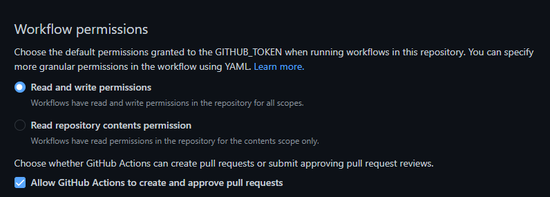

# Suresofttech Vulcan for GitHub Actions

Vulcan is a handy and claver supporter for trivial fault in your C/C++ code. It can find it, and even can fix it!

Vulcan action can be triggered by a regression tests, or you can run it seperately. After all the processes, it generate issue and pull request itself. If there are multiple faults and they were figured out from different testsets, those two output will be generated for each fault.

* Issue - Show which test failed and suspicious location ranking from SBFL(Spectrum Based Fault Localization). If there are some suggestions for the fault, the issue also show the generated patch to fix it.
* Pull requests - If the patch was generated well, Vulcan sends pull request about it.

**(You have to set the permission of GitHub action as this image)**



To add Vulcan to your test workflow or just run it, follow the steps under the *Requirements* section.

## Requirements
* The fault must be single line fault
* The project have to use 'make' command to build


## Step 1: Set Runner

You can run Vulcan in two different ways. It can be run on your self-hosted-runner, or GitHub runner. For each case, you have to set up your .yml file. There is an example.

**Case 1: Use GitHub runner**
You don't have to do anything! Please follow next step.

**Case 2: Use your self hosted runner**

* Set docker container in your workspace

Additionally, you have to set the runner with provided docker image.

1. Pull image

```
   docker pull 0cherry/vulcan:demo
```

2. Run container from above image and run self-hosted-runner in the container
   (In your repository, you can find an manual to run the self hosted runner in 'Action' tab.)


## Step2. Set your workflow .yml file
* Add checkout to your workflow:

  For Vulcan to run, check out your repository using [actions/checkout@v2](https://github.com/actions/checkout). For example:

```
- name: Checkout vulcan target
  uses: actions/checkout@v2
```

* Add Vulcan to your workflow: 

To use Vulcan, some steps are required in your workflow. For example:
```
name: Vulcan Demo

on:
  workflow_dispatch:
  # push

jobs:
  vulcan:
    runs-on: ubuntu-20.04

    steps:
      - name: Checkout vulcan target
        uses: actions/checkout@v2
      - name: Run vulcan action
        uses: Suresoft-GLaDOS/vulcan-action@$v
```

* **In case 2, you have to checkout other vulcan-action branch for self-hosted-runner. Please follow this.**
```
    steps:
      - name: Checkout vulcan target
        uses: actions/checkout@v2
      - name: Run vulcan action
        uses: Suresoft-GLaDOS/vulcan-action@$v_self_runner

```


## Step 3: Set vulcan.yml

In your repository, there should be vulcan.yml file. A simple example of vulcan.yml file is here.

```
--- # Start
name: example # User's project name

# Timeout about program repair(second)
time-out: 10

# Command to build user's project
test-build-command: | 
  make clean
  make
  
# Command to build user's project with coverage measurement 
coverage-build-command: | 
  make clean
  make CFLAGS="--coverage -g -O0" LDFLAGS="-lgcov"

test-list: | # Test commands list
  ./test 0
  ./test 1
  ./test 2
  ./test 3
  ./test 4

# Get the command from test-list and run each of them
test-command: | # Run tests
  bash -c "@testcase@"
test-coverage-command: | # Run coverage tests 
  bash -c "@testcase@"
  
gcov-exclusion-list: | # Do not measure coverage from those files
  test.o

```

To make it work in your project, you have to set each items in the vulcan.yml properly.

* Required
  - test-build-command
  - coverage-build-command
  - test-list
  - test-command
  - test-coverage-command

* Optional
  - time-out
  - gcov-exclusion-list

## Result

The following is an example of issue and pull request from Vulcan.

  * Generated GitHub Issue


  * Generated Pull request


